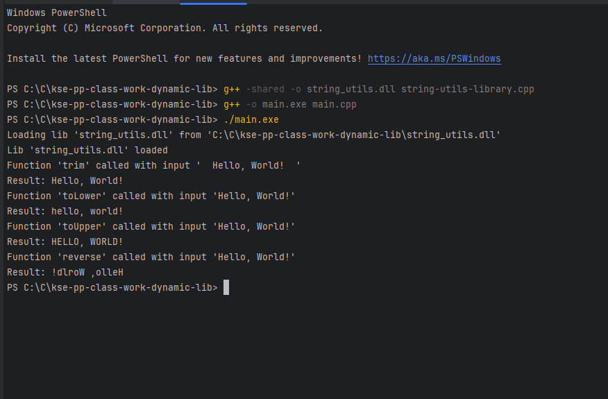

# Programming Paradigms (class work)

### Task: Practice bundling executable and dynamic library written in C++

#### Кроки виконання:
- впевнився, що маю встановлений GCC компілятор (MinGW для Windows), 
і він доступний в PATH, аби можна було ранити команди через термінал, а не IDE
- створив root папку проекту ("kse-pp-class-word-dynamic-lib")
- cтворив `main.cpp` та `CMakeLists.txt` файли (в подальшому мій executable проект)
- створив `string-utils-library.h` та `.cpp`, з кількома функціями для роботи з string.
  (linking через `extern "C"`, та експорт функцій через `__declspec(dllexport)`)
- додав код у `main.cpp` який пробує завантажити функції з цієї `string_utils.dll` бібліотеки,
і виконує їх з якимись даними для прикладу. для завантаження ліби використовуються функції з `windows.h`.
- далі я зкомпілював `string-utils-library.cpp` бібліотеку в `string_utils.dll`, `main.cpp` в `main.exe` і запустив.
ось результат в консолі:

